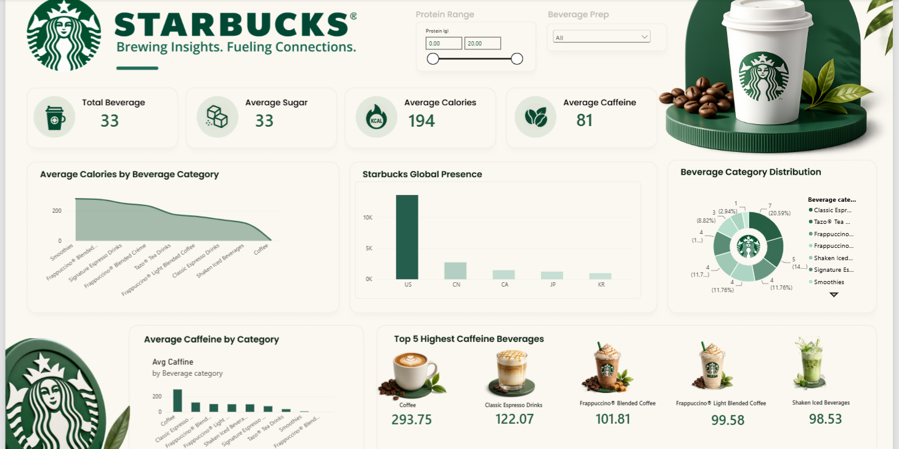

# Starbucks Beverage Analysis Dashboard

## 1. Project Title

Starbucks Beverage Analysis Dashboard

## 2. Short Description / Purpose

A Power BI dashboard project focused on analyzing Starbucks beverage nutrition data to understand beverage categories, calories, sugar, caffeine, protein, and Starbucks' global presence.

The dashboard provides an interactive view of beverage characteristics and helps identify categories and beverages with higher nutritional and caffeine values.

## 3. Tech Stack

- Power BI
- DAX
- Power Query
- CSV

## 4. Data Source

The project uses Starbucks beverage and location data containing information related to:

- Beverage names
- Beverage categories
- Calories
- Sugar
- Protein
- Caffeine
- Beverage preparation
- Starbucks locations

## 5. Features & Highlights

### Dashboard KPIs

- Total Beverages: 33
- Average Sugar: 33
- Average Calories: 194
- Average Caffeine: 81

### Beverage Analysis

- Average calories by beverage category
- Average caffeine by beverage category
- Beverage category distribution
- Top 5 highest-caffeine beverages
- Nutritional comparison across beverage categories

### Global Presence Analysis

- Starbucks presence across countries
- Country-wise store distribution

### Key Insights

- The dashboard compares nutritional characteristics across different Starbucks beverage categories.
- Caffeine levels vary significantly across beverage categories.
- The highest-caffeine beverages are highlighted for comparison.
- Calories and sugar are analyzed at an overall and category level.
- Starbucks' global presence is compared across selected countries.

## 6. Screenshots / Demo

### Starbucks Beverage Analysis Dashboard

